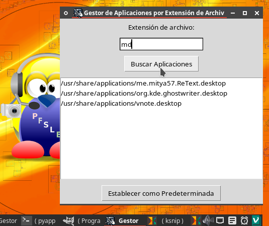

# LinuxAppManager
Necesitaba yo un programa que me muestre únicamente los programas que pueden abrir una extensión de archivo y que me permita seleccionar una de ellas y ponerla como aplicación para abrir por defecto, esta es mi creación.

### **Manual de Instalación y Uso de LinuxAppManager**

Este documento te guiará en la instalación y uso del programa **LinuxAppManager**, que puedes encontrar en su repositorio de GitHub:  
[LinuxAppManager](https://github.com/wachin/LinuxAppManager)

---

## **Requisitos Previos**

Para ejecutar el programa, necesitas tener instalados los siguientes paquetes en el sistema Debian 12 (o basado en Debian):

1. **Python 3**  
   Python debe estar instalado, pero sino puedes instalarlo ejecutando:  
   ```bash
   sudo apt install python3
   ```

2. **Tkinter (librería para interfaces gráficas) y git**  
   Tkinter es necesario para ejecutar la interfaz gráfica del programa y git para clonarlo:  
   ```bash
   sudo apt install python3-tk git
   ```

---

## **Instalación**

1. **Clona el repositorio**  
   Descarga el código fuente desde GitHub:  
   ```bash
   git clone https://github.com/wachin/LinuxAppManager
   ```

2. **Accede al directorio del proyecto**  
   Navega al directorio del proyecto:  
   ```bash
   cd LinuxAppManager
   ```

3. **(Opcional) Instala el ícono para `appmanager_v2.py`**  
   Si deseas usar la versión con ícono, necesitas copiar el archivo del ícono a la ubicación estándar del sistema:  
   ```bash
   cp src/appmanager.png.png ~/.local/share/icons/appmanager.png
   ```
También puedes copiarlo manualmente con un administrador de archivos

---

## **Uso del Programa**

### **Versión sin ícono (`appmanager.py`)**

1. Ejecuta el programa con:  
   ```bash
   python3 appmanager.py
   ```
2. Esta versión no requiere la instalación de un ícono adicional.

---

### **Versión con ícono (`appmanager_v2.py`)**

1. Asegúrate de haber instalado el ícono siguiendo los pasos de instalación.  
2. Ejecuta el programa con:  
   ```bash
   python3 appmanager_v2.py
   ```
3. Si el ícono no se muestra, verifica que el archivo `appmanager.png` esté en la ruta `~/.local/share/icons/`.



---

## **Manual de Uso**

El programa tiene dos funcionalidades principales: 

### **1. Buscar Aplicaciones por Extensión**

- **Pasos**:  
  1. Ingresa la extensión del archivo (sin el punto, por ejemplo, `txt` o `md`) en el cuadro de texto.
  2. Haz clic en **"Buscar Aplicaciones"**.  
  3. Se mostrará una lista de las aplicaciones que pueden abrir esa extensión.  

- **Nota**: Si no se encuentra ninguna aplicación, asegúrate de que el sistema tenga instaladas aplicaciones que puedan abrir el tipo de archivo buscado.

---

### **2. Establecer una Aplicación Predeterminada**

- **Pasos**:  
  1. Selecciona una aplicación de la lista que aparece tras buscar.
  2. Haz clic en **"Establecer como Predeterminada"**.  
  3. La aplicación seleccionada será configurada como predeterminada para la extensión ingresada.

---

## **Problemas Comunes y Soluciones**

1. **El ícono no aparece en la versión con ícono (`appmanager_v2.py`)**  
   - Verifica que el archivo `appmanager.png` esté ubicado en `~/.local/share/icons/`.

2. **No se encuentran aplicaciones para una extensión**  
   - Asegúrate de que exista un programa en el sistema que pueda manejar el tipo de archivo buscado.  
   - Puedes instalar aplicaciones adicionales desde los repositorios de tu distribución.

---

Con estos pasos, tendrás **LinuxAppManager** completamente funcional en tu sistema. ¡Disfrútalo! 😊 Dios te bendiga