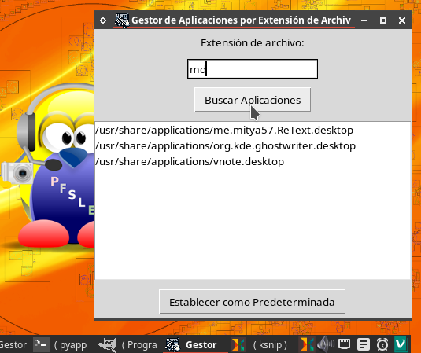

# LinuxAppManager

LinuxAppManager is a small graphical utility for Linux desktops that helps you
manage default applications and file associations without editing MIME files by
hand.

It is useful when you want to see which installed programs can open a specific
file extension and choose one of them as the default application. It can also
manage common system defaults from a simple interface.



---

## What LinuxAppManager Does

LinuxAppManager can:

- Search compatible applications by file extension, for example `pdf`, `txt`,
  `jpg`, `mp4`, or any other extension recognized by your system.
- Detect the MIME type for that extension using `xdg-mime`.
- List installed `.desktop` launchers that declare support for that MIME type.
- Set the selected application as the default handler for that file type.
- Show and change common default applications:
  - File Manager
  - Web Browser
  - Text Editor
  - Email Client
  - PDF Viewer
  - Image Viewer
  - Video Player
  - Audio Player
  - Terminal Emulator
- Show the current default application for supported categories.
- Change the default terminal emulator through `update-alternatives`
  (`pkexec` may ask for administrator authentication).
- Load translations automatically according to your system language.

The application is designed around standard Linux desktop tools such as
`xdg-mime`, `xdg-settings`, `.desktop` files, and `update-alternatives`.

---

## Available Languages

LinuxAppManager is available in **17 languages/locales**:

- English
- Arabic
- Chinese, Simplified
- Chinese, Traditional
- Dutch
- French
- German
- Italian
- Japanese
- Korean
- Polish
- Portuguese, Brazil
- Russian
- Spanish
- Swedish
- Turkish
- Ukrainian

The program automatically tries to use the language configured in your system.
If a translation is not available, it falls back to English.

---

## Requirements

On Debian 12 or Debian-based systems, install the runtime dependencies with APT:

```bash
sudo apt install python3 python3-pyqt6 xdg-utils git
```

`pip` is **not required** to run LinuxAppManager if PyQt6 is installed from your
distribution packages.

Using `pip` is optional. It is only needed if you prefer to install the Python
dependency from `requirements.txt` instead of using your system package manager.

Optional `pip` method:

```bash
python3 -m pip install -r requirements.txt
```

---

## Run From Source

Clone the repository:

```bash
git clone https://github.com/wachin/LinuxAppManager
cd LinuxAppManager
```

Run the program:

```bash
python3 app_manager.py
```

---

## Optional Icon Setup

The program can use the icon directly from the repository. If you want to
install the icon into your local icon directory, run:

```bash
mkdir -p ~/.local/share/icons/
cp assets/appmanager.svg ~/.local/share/icons/appmanager.svg
```

---

## Optional Python Package Installation

If you prefer to install the project as a Python package, you can do it with
`pip`. This is optional and is not required for normal execution from source.

```bash
python3 -m pip install .
linux-app-manager
```

---

## User Guide

### Search Applications by Extension

1. Open the **By Extension** tab.
2. Enter a file extension without the dot, for example `pdf` or `txt`.
3. Click **Search Applications**.
4. Select an application from the list.
5. Click **Set as Default**.

### Manage Default Applications

1. Open the **Default Applications** tab.
2. Select a category, such as Web Browser, File Manager, or PDF Viewer.
3. Review the current default shown by the program.
4. Select the preferred application.
5. Click **Set as Default**.

For the Terminal Emulator category, LinuxAppManager uses the system
`x-terminal-emulator` alternative. Changing it may require administrator
authentication.

---

## License

LinuxAppManager is released under the GPL3 license.
